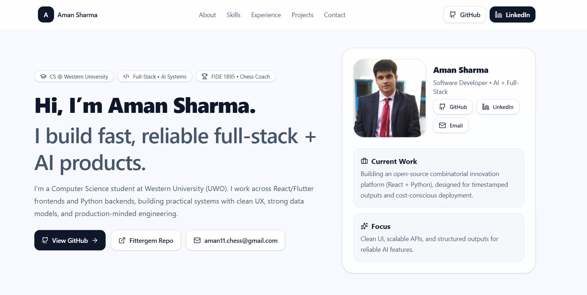

# 🗂 aman-portfolio

Personal developer portfolio — built with React, TailwindCSS v4, and Framer Motion.

🔗 **Live:** [aman-portfolio-three-xi.vercel.app](https://aman-portfolio-three-xi.vercel.app/)

---



---

## ✨ Features

- **Single-page layout** — About, Skills, Experience, Projects, Contact all in one smooth scroll
- **Framer Motion animations** — fade-up entrance animations and staggered children
- **Contact form** — opens native email client with prefilled message (no backend needed)
- **Fully responsive** — mobile, tablet, and desktop
- **Sticky nav** — smooth scroll to sections with active blur backdrop

---

## 🛠 Tech Stack

| Technology | Usage |
|-----------|-------|
| React 18 | UI framework |
| TailwindCSS v4 | Styling |
| Framer Motion | Animations |
| Lucide React | Icons |
| Vercel | Deployment |

---

## 📁 Project Structure

```
src/
├── assets/
│   └── aman.png          # Profile photo
├── pages/
│   └── Page.jsx          # Main single-page component
├── App.jsx
└── main.jsx
```

---

## ⚙️ Getting Started

```bash
# Clone the repo
git clone https://github.com/venom11-coder/Aman-portfolio.git
cd Aman-portfolio

# Install dependencies
npm install

# Start dev server
npm run dev
```

Open [http://localhost:5173](http://localhost:5173) to view it locally.

---

## 🚀 Deployment

Deployed on **Vercel** with automatic deploys on push to `main`.

To deploy your own fork:
1. Push to GitHub
2. Import repo on [vercel.com](https://vercel.com)
3. Deploy — zero config needed for Vite + React

---

## 👨‍💻 Developer

**Aman Sharma** — CS Student @ Western University
[LinkedIn](https://www.linkedin.com/in/aman-sharma-086310271/) · [GitHub](https://github.com/venom11-coder)
